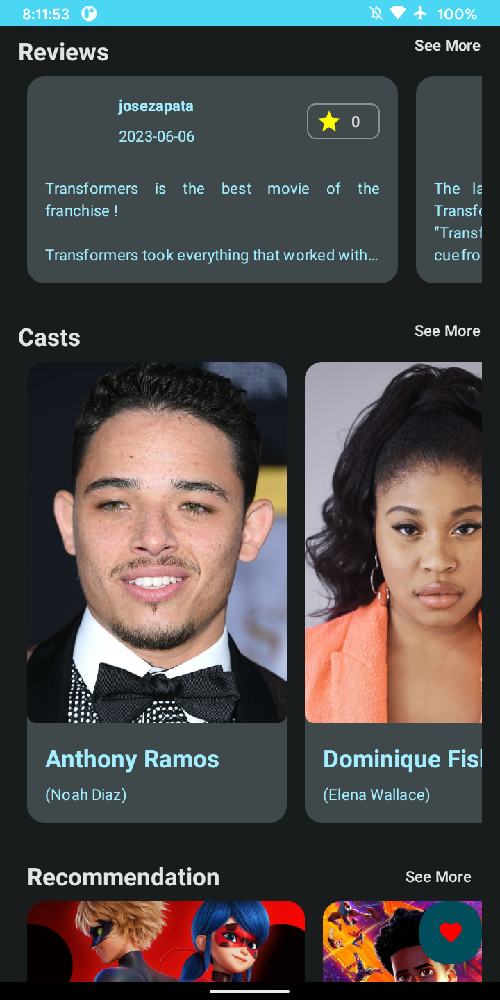

# MovFlex

Welcome to the MovFlex! This repository showcases my Android app, MovFlex, which
aims to showcase my skill and applying what I've learned in Android Development. Whether you're an
app enthusiast
or a fellow developer, this README will guide you through setup instructions,
and how you can contribute to the project.

## Table of Contents

- [App Preview](#App Preview)
- [Features](#Features)
- [Getting Started](#Getting Started)
    - [Prerequisites](#Prerequisites)
    - [Installation](#Installation)
- [Usage](#Usage)
- [Contributing](#Contributing)
- [Bug Reporting](#Bug Reporting)
- [Contact](#Contact)
- [License](#License)

## App Preview





## Getting Started

Follow these steps to get the app up and running on your Android device or emulator.

### Prerequisites

- Android Studio: [Download](https://developer.android.com/studio) and install the latest version of
  Android Studio.
- Android Device or Emulator: Ensure you have a physical Android device connected or an emulator set
  up in Android Studio.

### Installation

1. **Clone the repository:** Clone this repository to your local machine using `git`.

   ```bash
   git clone https://github.com/onirutlA/MovFlex.git
   cd MovFlex
   ```

2. **Open in Android Studio:** Launch Android Studio and select "Open an existing Android Studio
   project." Navigate to the folder where you cloned the repository and open it.

3. **Build and Run:** Wait for the project to build, and then click the "Run" button in Android
   Studio. Select your connected Android device or choose an emulator to run the app.

## Library Used

- Kotlin based, Coroutines + Flow for asynchronous.
- Hilt for dependency injection.
- Jetpack
    - Compose - UI toolkit.
    - Lifecycle - dispose of observing data when lifecycle state changes.
    - ViewModel - UI related data holder, lifecycle aware.
    - Room Persistence - construct the database using the abstract layer.
    - Data Store - Persist user preference
    - Navigation Component - Navigate to another fragment
- Architecture
    - MVVM Architecture
    - Repository pattern
    - Multi Module
- Retrofit2 & OkHttp3 - construct the REST APIs.
- Moshi - A modern JSON library for Kotlin and Java.
- Coil - Image Loading Library.
- Material-Components - Material design components for building ripple animation, and CardView.

## Contributing

Your contributions to this project are highly appreciated! To contribute, follow these steps:

1. Fork the repository and create a new branch.
2. Make your changes and ensure the code is well-tested.
3. Commit your changes and push them to your fork.
4. Submit a pull request, explaining the changes you've made.

## Bug Reporting

If you encounter any bugs, issues, or have suggestions for improvements, please open an issue on the
repository. Provide as much detail as possible to help us understand and resolve the problem
quickly.

## Contact

*Provide information about how users or other developers can get in touch with you. This can include
your email, social media profiles, or links to your personal website.*

## License

This project is licensed under the [MIT License](LICENSE). Feel free to use, modify, and distribute
the app's code following the terms of this license.
